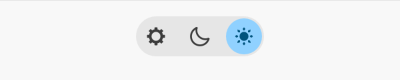

# `egui-theme-switch`

[](https://docs.rs/egui-theme-switch)
[](https://crates.io/crates/egui-theme-switch)

A *very* pretty theme switch widget for your egui app.
It allows you to choose between dark, light and follow system.

<picture>
    <source media="(prefers-color-scheme: dark)" srcset="doc/dark.png">
    
</picture>

## Example

```rust
use egui_theme_switch::{ThemeSwitch, ThemePreference};

let mut preference = ThemePreference::System;

if ui.add(ThemeSwitch::new(&mut preference)).changed() {
    // ...
});
```

## [Interactive Demo](https://tau.garden/egui-theme-switch/)

## [Docs](https://docs.rs/egui-theme-switch)

## License
Licensed under either of

* Apache License, Version 2.0
  ([license-apache.txt](license-apache.txt) or <http://www.apache.org/licenses/LICENSE-2.0>)
* MIT license
  ([license-mit.txt](license-mit.txt) or <http://opensource.org/licenses/MIT>)

at your option.

## Contribution
Unless you explicitly state otherwise, any contribution intentionally submitted
for inclusion in the work by you, as defined in the Apache-2.0 license, shall be dual licensed as above, without any additional terms or conditions.
